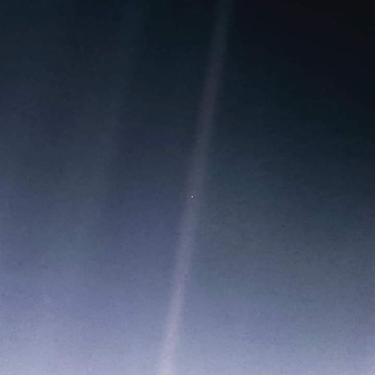

Ouço, não uma voz  
Vejo, não letras  
Sinto o cheiro, não do aroma  
Sinto, não a força  
Saboreio, não o gosto de qualquer coisa  
Apenas atravesso  
como um passageiro  
Sou também o dono da fabrica e do trem  
Sou o trem  
A linha  
Mas também sou poeira no espaço  
Sou a dança cósmica que organiza a vida  
Mas principalmente sou o nada, que dá espaço à todas as coisas  
E eu sou você também  
Se você se abraçar agora  
Vai estar me abraçando também  
E se for assim, que esse abraço não termine nunca.
